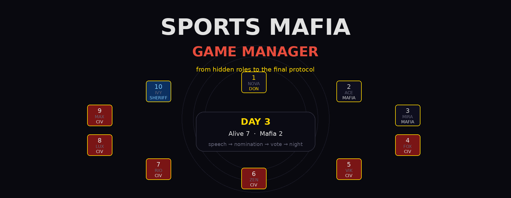
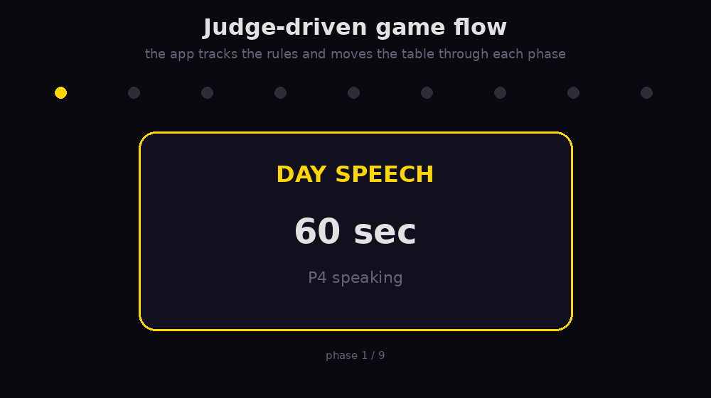
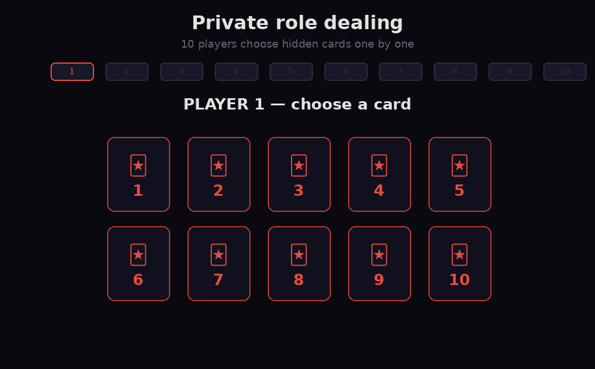
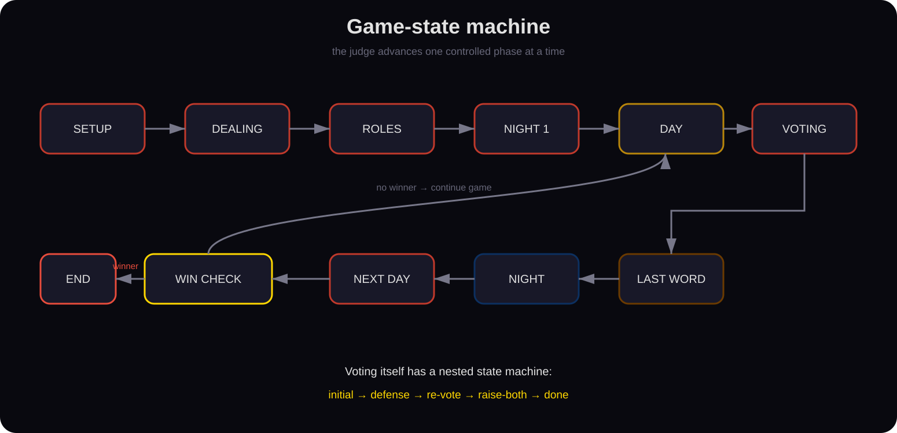
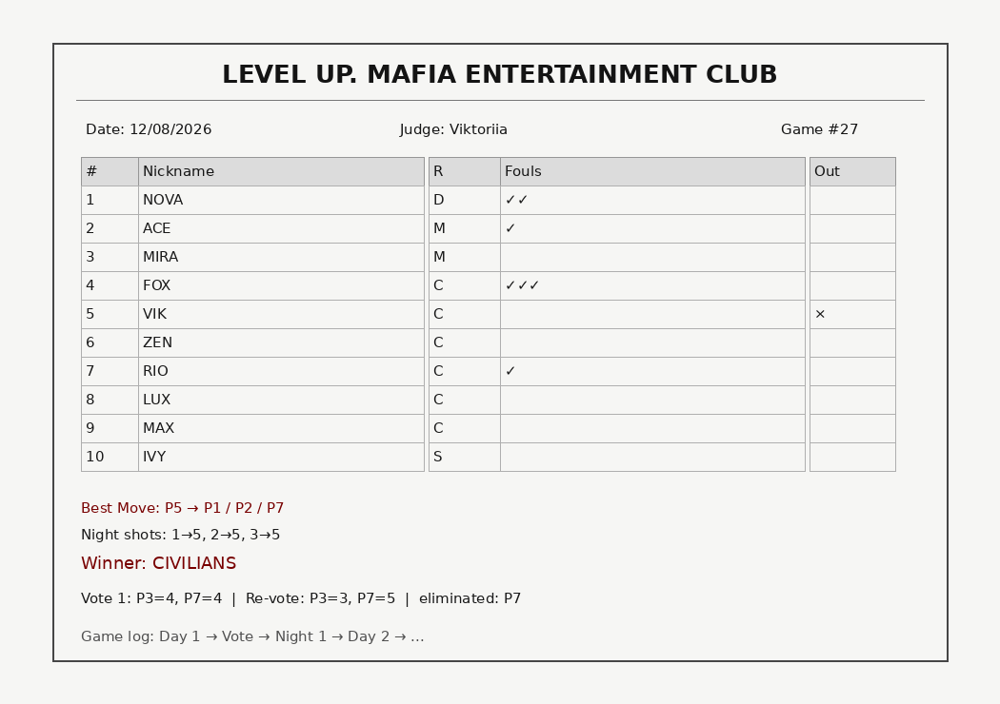

<p align="center">
  
</p>

<p align="center">
  <b>A judge-first control system for running a complete competitive Sports Mafia match.</b><br>
  Hidden role dealing, timed speeches, nominations, tie-aware voting, fouls, night actions, win detection, and a printable final protocol — in one React interface.
</p>

<p align="center">
  
  
  
  
  
</p>

---

## More than a score sheet

Sports Mafia is a structured social-deduction game with strict timing, role secrecy, speaking order, nominations, penalties, voting procedures, night actions, and judge decisions.

The purpose of this app is to make the judge's job **deterministic and auditable**.

Instead of keeping timers, fouls, nominations, night shots, and vote history on paper, the application keeps the entire match inside one explicit game state.

```text
setup → private dealing → night 1 → day → voting → night → ... → winner
```

<p align="center">
  
</p>

---

## Private role dealing

A new match always contains 10 roles:

```text
1 Don
2 Mafia
6 Civilians
1 Sheriff
```

Roles are shuffled with Fisher–Yates and converted into a physical-style digital dealing phase.

Players take the device one at a time, choose one of the remaining hidden cards, privately reveal the role, confirm it, and pass the device onward.

<p align="center">
  
</p>

The role is written directly to the matching player only after the card is selected, while the remaining cards are re-numbered for the next player.

---

## The match is a state machine

The app is intentionally built around explicit phase transitions rather than one giant free-form screen.

<p align="center">
  
</p>

The top-level screens include:

```text
setup
dealing
roles
night1
day
lastword
voting
night
end
```

Voting has its own nested state machine:

```text
initial → defense → revote → raise_both → done
```

That separation is important: the UI always knows **what the judge is allowed to do next**.

---

## Day phase

Every day creates a circular speaking order.

For Day 1, speech starts from the first seat.  
Each new day shifts the starting seat by one position.

The application automatically skips players who are:

- eliminated;
- silenced after reaching 3 fouls.

Every active speaker gets a **60-second timer** with pause / resume controls.

During the speech, the judge can nominate players directly from the table.

---

## Voting logic

Voting is one of the most rule-heavy parts of the project.

The app handles all of these cases:

### One nominee

The player receives a last word and is eliminated without a normal vote.

### Clear majority

The leading nominee receives a last word and is eliminated.

### Tie

The tied players enter a **30-second defense** phase one by one.

After all defenses:

```text
re-vote
```

If the re-vote is still tied, the app opens the **raise-both** decision.

The threshold is computed from the number of living players:

```js
Math.floor(alivePlayers / 2) + 1
```

If the threshold is reached, all tied candidates are eliminated.

Every vote and re-vote is retained in `voteLog` and later appears in the final protocol.

---

## Fouls are part of the game state

The judge can record a foul reason from the built-in foul list.

Examples include:

```text
Speaking out of turn
Signals during voting
Using phone
Speaking after elimination
Showing cards
Excessive table noise
```

The penalty progression is automatic:

| Fouls | Effect |
|---:|---|
| 1–2 | warning |
| 3 | speech revoked |
| 4 | automatic elimination |

A three-foul player remains alive but is automatically excluded from future speech order.

Four fouls trigger elimination and an immediate win-condition check.

---

## Night phase

After voting, the table moves into a controlled night sequence.

### Mafia shots

Every living Mafia member selects a target.

The implementation follows an agreement rule:

> if all living Mafia members do not shoot the same target, nobody dies.

So the night kill only succeeds when the Mafia reaches a unanimous target.

### Don check

The Don can inspect a player and learn whether that player is the Sheriff.

### Sheriff check

The Sheriff can inspect a player and learn whether the player belongs to Mafia / Don.

All checks and shots are written to the game log.

---

## Timers

The reusable `Timer` component powers several game phases:

| Phase | Duration |
|---|---:|
| Player speech | 60 s |
| Last word | 60 s |
| Tie defense | 30 s |
| Night 1 — Mafia | 60 s |
| Night 1 — Sheriff | 10 s |
| Free seating | 20 s |

Each timer:

- auto-starts;
- shows a circular progress ring;
- supports pause / resume;
- can reset after reaching zero;
- can trigger the next speech automatically.

---

## Automatic win detection

The application checks the table after eliminations.

```text
mafia alive = 0
        ↓
CIVILIANS WIN
```

and

```text
mafia alive ≥ civilian-side alive
        ↓
MAFIA WINS
```

The civilian side includes Civilians and the Sheriff.  
The Mafia side includes Mafia and the Don.

---

## Best Move

After the first night victim is known, the app can record the classic **Best Move**:

> the first killed player identifies three suspected Mafia players.

The judge selects exactly three players, and the interface can immediately calculate how many of the three guesses are correct.

The result is preserved for the final protocol.

---

## Match history and observability

Nearly every important judge action creates a timestamped log entry:

```text
Cards shuffled
Day speech order
Player nominated
Foul recorded
Vote result
Re-vote result
Night kill
Don check
Sheriff check
Player eliminated
```

The log can be opened during the game and is included in the exported protocol.

---

## Nickname memory

Player nicknames are stored locally in the browser under:

```text
mafiaH
```

When the judge starts typing a name in a later match, the app suggests previously used nicknames.

No backend is required.

---

## Final protocol export

At any point, the judge can export the match record.

<p align="center">
  
</p>

The generated protocol includes:

- judge and game number;
- player names and roles;
- foul marks;
- eliminated players;
- Don and Sheriff seats;
- winner;
- Best Move;
- night shots;
- up to five vote tables;
- re-votes;
- complete timestamped game log.

### Important detail

The current `printPDF()` implementation creates a **print-ready HTML file**, not a native PDF binary.

Open the downloaded `.html` file in a browser and choose:

```text
Print → Save as PDF
```

This preserves the A4-oriented protocol layout.

---

## Architecture

This is a fully client-side React application.

```text
┌───────────────────────────────────────────┐
│                  React App                │
│                                           │
│  setup / dealing / day / voting / night  │
│                   │                       │
│             central game state            │
│          players · votes · shots          │
│          fouls · timers · logs            │
│                   │                       │
│        ┌──────────┴──────────┐             │
│        ↓                     ↓             │
│   localStorage          Blob / download    │
│ nickname history      printable protocol  │
└───────────────────────────────────────────┘
```

There is:

```text
no backend
no database
no authentication
```

The browser holds the current match state.

---

## Core implementation ideas

### Immutable React updates

Player state is updated with immutable transforms such as:

```js
setPlayers(players =>
  players.map((player, index) =>
    index === target
      ? { ...player, eliminated: true }
      : player
  )
);
```

### Derived game state

Living players and living Mafia are calculated from the canonical player list rather than stored independently.

### Explicit transitions

Functions such as:

```text
startGame()
goDay()
goVoting()
confirmVote()
confirmRevote()
startNight()
handleNightEnd()
checkWin()
```

act as transitions in the match state machine.

---

## Run locally

```bash
npm install
npm run dev
```

Vite will print the local development URL.

Production build:

```bash
npm run build
```

Preview:

```bash
npm run preview
```

---

## Repository structure

```text
sports-mafia-game-manager/
├── README.md
├── package.json
├── index.html
├── assets/
│   ├── hero.png
│   ├── private_dealing.gif
│   ├── judge_flow.gif
│   ├── state_machine.svg
│   └── protocol_preview.png
└── src/
    ├── App.jsx
    └── main.jsx
```

---

## Current limitations

The project is intentionally optimized for a judge operating one local device.

Current architectural limitations:

- the main game logic lives in one large React component;
- match state is not persisted across a browser refresh;
- there is no multi-device synchronization;
- no backend or match-history database;
- role secrecy depends on physically passing the same device;
- night music uses an external YouTube embed;
- protocol export is HTML-for-print rather than a generated PDF binary;
- automated tests for game-state transitions are not yet included.

These are natural next boundaries for turning the application from a local judge tool into a tournament platform.

---

## Natural next evolution

```text
component extraction
      ↓
state reducer / finite-state machine
      ↓
persistent match storage
      ↓
multi-table tournament dashboard
      ↓
real-time synchronization
```

Potential additions include TypeScript, keyboard shortcuts, configurable rulesets, PWA/offline support, automated state-transition tests, and tournament statistics.

---

<p align="center">
  <b>The players play the game. The app remembers the rules.</b>
</p>
